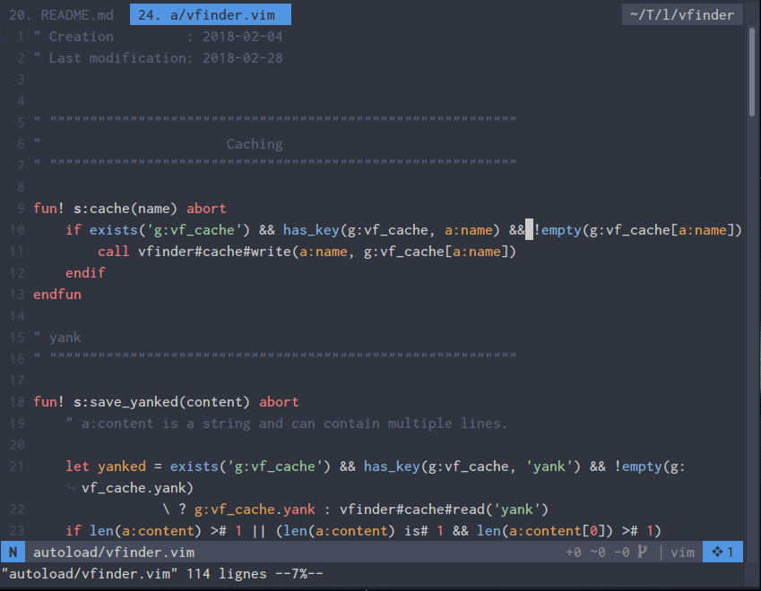

# vFinder [EXPERIMENTAL]


A versatile finder for vim.



**N.B:**

The plugin:

- Is my playground plugin and may change a lot (until v1.0).
- Is not windows compatible yet.
- Is non asynchronous (yet?) (see next line).
- Medium sized projects (<= 20000 files) work as expected (thanks to external tools like `rg`, `ag`...).
- Use some features from last vim versions so it may not work on old ones.

# Usage

```viml
call vfinder#i({source}[, {options}])
```

- `{source}` can be a [built-in source](#default-sources) or a custom one.
- `{options}` is a dictionnary of [facultative options](#default-sources-options) relative to the buffer/window.

```viml
" Execute a default source
call vfinder#i('files')

" Same thing but with fuzzy mode enabled
call vfinder#i('files', {'fuzzy': 1})

" Fuzzy mode in a vertical split window and an initial query
call vfinder#i('tags_in_buffer', {
        \   'fuzzy': 1
        \   'win_pos': 'vertical',
        \   'query': expand('<cexpr>')
        \ })

" Custom source
call vfinder#i({
        \   'name'      : 'custom',
        \   'to_execute': ['~/.foo', '~/lab/bar'],
        \   'maps'      : {
        \       'i': {'<CR>': {'action': 'cd %s', 'options': {}}},
        \       'n': {'<CR>': {'action': 'cd %s', 'options': {}}}
        \   }
        \ })
```

The candidates are gathered from the key `to_execute` which can be:

- A filename : `'path/to/foo'`
- A funcref : `function('s:foo')`
- A list : `['foo', 'bar']`
- A shell command: `'foo -f --flag2'`

There are no mappings provided for executing sources, please define your owns (See the example of configuration below).

# Global options

| options                         | default value                     | description                                   |
| ------------------------------- | --------------------------------- | --------------------------------------------- |
| `g:vfinder_fuzzy`               | `0`                               | Enable/Disable fuzzy matching (May be slow)   |
| `g:vfinder_win_pos`             | `'topleft'`                       | Default position of the window                |
| `g:vfinder_flash`               | `1`                               | Flash target line when executing some actions |
| `g:vfinder_cache_path`          | `$HOME . '/.cache/vfinder'`       | Directory where to store cache files          |
| `g:vfinder_yank_source_enabled` | `1`                               | Enable/Disable yank source which use caching  |
| `g:vfinder_mru_source_enabled`  | `1`                               | Enable/Disable mru source which use caching   |
| `g:vfinder_maps`                | _See the part about **Mappings**_ | Global & per sources actions/mappings         |

# <a name="default-sources">Default sources</a>

The built-in sources:

| source name                  | description                        | default actions                                  |
| ---------------------------- | ---------------------------------- | ------------------------------------------------ |
| `buffers`                    | List of buffers                    | edit, edit in (v)split/tab, wipe, toggle hiddens |
| `colors`                     | List of installed colorschemes     | apply, preview                                   |
| `command_history`            | History of vim commands            | execute, echo                                    |
| `commands`                   | Vim commands                       | execute, echo                                    |
| `directories`                | List of directories in the cwd     | goto, go_back, cd                                |
| `files`<sup>n</sup>          | Recursive list of files in the cwd | open, open in a (v)split/tab, toggle git flags   |
| `marks`                      | List of marks                      | goto, delete                                     |
| `mru`<sup>c</sup>            | List of recent files               | open, open in a (v)split/tab                     |
| `oldfiles`                   | Output of `:oldfiles`              | open, open in a (v)split/tab                     |
| `tags_in_buffer`<sup>t</sup> | List of tags in current buffer     | goto, open in a (v)split                         |
| `registers`                  | Values of registers                | paste                                            |
| `spell`                      | Suggestions for the current word   | use suggestion                                   |
| `tags`                       | List of tags from tagfiles         | goto, open in (v)split/tab, preview              |
| `yank`<sup>c</sup>           | All yanked elements                | paste                                            |

_**<sup>n</sup>** Need `rg`, `ag`, `git` or `find`._  
_**<sup>t</sup>** Need `ctags`._  
_**<sup>c</sup>** Use cache files._

The default mappings are: `<CR>`, `<C-s>`, `<C-v>`, `<C-t>`, `<C-o>` (see [per source mappings](#per-source-mappings))

## <a name="default-sources-options">Source options</a>

| option    | default value       | description       |
| --------- | ------------------- | ----------------- |
| `fuzzy`   | `g:vfinder_fuzzy`   | Fuzzy mode        |
| `query`   | `''`                | Initial query     |
| `win_pos` | `g:vfinder_win_pos` | Window's location |

# Mappings

The plugin defines mappings only for the vfinder file type and all of them can be
overwritten with `g:vfinder_maps`.  
The syntax to overwrite a default mapping is the following:

```viml
let g:vfinder_maps = {}
let g:vfinder_maps.scope = {
            \   'i': {
            \       'action1': 'keys',
            \       'action2': 'keys',
            \   },
            \   'n': {
            \       'action' : 'keys',
            \       'action2': 'keys',
            \   }
            \ }
```

Where `i` (insert) and `n` (normal) are the modes where the combination(s) action/keys operates.  
And where `scope` can be:

- `_`: Global mappings that affect all vfinder windows.
- `<source_name>`: Mappings specific to the `<source_name>`.

## Global mappings

| mode | action                 | description                                                          | default value |
| :--: | ---------------------- | -------------------------------------------------------------------- | :-----------: |
| `i`  | `prompt_backspace`     | -                                                                    |    `<BS>`     |
| `i`  | `prompt_delete`        | -                                                                    |    `<Del>`    |
| `i`  | `prompt_delete_line`   | -                                                                    |    `<C-u>`    |
| `i`  | `prompt_delete_word`   | -                                                                    |    `<C-w>`    |
| `i`  | `prompt_move_down`     | -                                                                    |    `<C-n>`    |
| `i`  | `prompt_move_left`     | -                                                                    |    `<C-h>`    |
| `i`  | `prompt_move_right`    | -                                                                    |    `<C-l>`    |
| `i`  | `prompt_move_to_end`   | -                                                                    |    `<C-e>`    |
| `i`  | `prompt_move_to_start` | -                                                                    |    `<C-a>`    |
| `i`  | `prompt_move_up`       | -                                                                    |    `<C-p>`    |
| `n`  | `start_insert_mode_a`  | -                                                                    |      `a`      |
| `n`  | `start_insert_mode_A`  | -                                                                    |      `A`      |
| `n`  | `start_insert_mode_i`  | -                                                                    |      `i`      |
| `n`  | `start_insert_mode_I`  | -                                                                    |      `I`      |
| `i`  | `window_quit`          | -                                                                    |    `<Esc>`    |
| `n`  | `window_quit`          | -                                                                    |    `<Esc>`    |
| `i`  | `candidates_update`    | Refresh candidates                                                   |    `<C-r>`    |
| `n`  | `candidates_update`    | ^^^^^^^^^^^^^^^^^^                                                   |      `R`      |
| `i`  | `cache_clean`          | Delete cache file if it exists                                       |    `<F5>`     |
| `n`  | `cache_clean`          | ^^^^^^^^^^^^^^^^^^^^^^^^^^^^^^                                       |    `<F5>`     |
| `i`  | `fuzzy_toggle`         | Enable/Disable fuzzy mode                                            |    `<C-f>`    |
| `n`  | `fuzzy_toggle`         | ^^^^^^^^^^^^^^^^^^^^^^^^^                                            |      `F`      |
| `i`  | `toggle_maps_in_sl`    | Show and toggle between source and global mappings in the statusline |    `<F1>`     |
| `n`  | `toggle_maps_in_sl`    | ^^^^^^^^^^^^^^^^^^^^^^^^^^^^^^^^^^^^^^^^^^^^^^^^^^^^^^^^^^^^^^^^^^^^ |    `<F1>`     |

e.g.

```viml
let g:vfinder_maps = {}
let g:vfinder_maps._ = {
            \   'i': {'candidates_update': '<C-f>'},
            \   'n': {'window_quit'      : 'q'}
            \ }
```

## <a name="per-source-mappings">Per source mappings</a>

### Buffers

| mode | action       | default value |
| :--: | ------------ | :-----------: |
| `i`  | `edit`       |    `<CR>`     |
| `n`  | `edit`       |    `<CR>`     |
| `i`  | `split`      |    `<C-s>`    |
| `n`  | `split`      |      `s`      |
| `i`  | `vsplit`     |    `<C-v>`    |
| `n`  | `vsplit`     |      `v`      |
| `i`  | `tab`        |    `<C-t>`    |
| `n`  | `tab`        |      `t`      |
| `i`  | `wipe`       |    `<C-d>`    |
| `n`  | `wipe`       |     `dd`      |
| `i`  | `toggle_all` |    `<C-o>`    |
| `n`  | `toggle_all` |      `o`      |

### Colors

| mode | action    | default value |
| :--: | --------- | :-----------: |
| `i`  | `apply`   |    `<CR>`     |
| `n`  | `apply`   |    `<CR>`     |
| `i`  | `preview` |    `<C-o>`    |
| `n`  | `preview` |      `o`      |

### Commands

| mode | action  | default value |
| :--: | ------- | :-----------: |
| `i`  | `apply` |    `<CR>`     |
| `n`  | `apply` |    `<CR>`     |
| `i`  | `echo`  |    `<C-o>`    |
| `n`  | `echo`  |      `o`      |

### Directories

| mode | action    | default value |
| :--: | --------- | :-----------: |
| `i`  | `goto`    |    `<CR>`     |
| `n`  | `goto`    |    `<CR>`     |
| `i`  | `go_back` |    `<C-v>`    |
| `n`  | `go_back` |      `v`      |
| `i`  | `cd`      |    `<C-s>`    |
| `n`  | `cd`      |      `s`      |

### Files

| mode | action             | default value |
| :--: | ------------------ | :-----------: |
| `i`  | `edit`             |    `<CR>`     |
| `n`  | `edit`             |    `<CR>`     |
| `i`  | `split`            |    `<C-s>`    |
| `n`  | `split`            |      `s`      |
| `i`  | `vsplit`           |    `<C-v>`    |
| `n`  | `vsplit`           |      `v`      |
| `i`  | `tab`              |    `<C-t>`    |
| `n`  | `tab`              |      `t`      |
| `i`  | `toggle_git_flags` |    `<C-g>`    |
| `n`  | `toggle_git_flags` |     `gi`      |

### Marks

| mode | action   | default value |
| :--: | -------- | :-----------: |
| `i`  | `goto`   |    `<CR>`     |
| `n`  | `goto`   |    `<CR>`     |
| `i`  | `delete` |    `<C-d>`    |
| `n`  | `delete` |     `dd`      |

### tags_in_buffer

| mode | action            | default value |
| :--: | ----------------- | :-----------: |
| `i`  | `goto`            |    `<CR>`     |
| `n`  | `goto`            |    `<CR>`     |
| `i`  | `split_and_goto`  |    `<C-s>`    |
| `n`  | `split_and_goto`  |      `s`      |
| `i`  | `vsplit_and_goto` |    `<C-v>`    |
| `n`  | `vsplit_and_goto` |      `v`      |

### Spell

| mode | action | default value |
| :--: | ------ | :-----------: |
| `i`  | `use`  |    `<CR>`     |
| `n`  | `use`  |    `<CR>`     |

### Tags

| mode | action            | default value |
| :--: | ----------------- | :-----------: |
| `i`  | `goto`            |    `<CR>`     |
| `n`  | `goto`            |    `<CR>`     |
| `i`  | `split_and_goto`  |    `<C-s>`    |
| `n`  | `split_and_goto`  |      `s`      |
| `i`  | `vsplit_and_goto` |    `<C-v>`    |
| `n`  | `vsplit_and_goto` |      `v`      |
| `i`  | `tab_and_goto`    |    `<C-t>`    |
| `n`  | `tab_and_goto`    |      `t`      |
| `i`  | `preview`         |    `<C-o>`    |
| `n`  | `preview`         |      `o`      |

### Yank

| mode | action  | default value |
| :--: | ------- | :-----------: |
| `i`  | `paste` |    `<CR>`     |
| `n`  | `paste` |    `<CR>`     |

Some sources do not have their own actions, because they inherit them from other sources, but you can still customize their mappings.

- `command_history` inherits from `commands`.
- `mru` & `oldfiles` inherits from `files`.
- `registers` inherits from `yank`.

e.g.

```viml
" Define g:vfinder_maps only if its not already defined.
let g:vfinder_maps = {}

let g:vfinder_maps.buffers = {
            \   'i': {
            \       'split' : '<C-k>',
            \       'vsplit': '<C-z>'
            \   }
            \ }
let g:vfinder_maps.spell = {
            \   'i': {'use': '<C-z>'}
            \   'n': {'use': 'zz'}
            \ }
```

# Create a source

**TODO**

## Source options

- name
- is_valid
- to_execute
- format_fun
- candidate_fun
- syntax_fun
- filter_name
- maps

## Actions

```viml
{
  i:{'action_name': {'action': '%s', 'options': {<see below>}}},
  n:{'action_name': {'action': '%s', 'options': {<see below>}}},
}
```

## Action map options

- clear_prompt: `0`
- echo : `0`
- execute_in_place : `1`
- flag: `0`
- function : `0`
- goto_prompt : `0`
- quit : `1`
- silent : `1`
- update : `0`

# My configuration

```viml
let g:vfinder_fuzzy = 0
let g:vfinder_maps = {}
let g:vfinder_maps._ = {
            \   'n': {'window_quit': 'q'},
            \   'i': {
            \       'toggle_maps_in_sl': '<Tab>',
            \       'cache_clean'      : '<C-x>'
            \   }
            \ }
nnoremap <silent> ,f :call vfinder#i('files')<CR>
nnoremap <silent> ,b :call vfinder#i('buffers')<CR>
nnoremap <silent> ,d :call vfinder#i('directories', {'win_pos': ''})<CR>
nnoremap <silent> ,r :call vfinder#i('mru')<CR>
nnoremap <silent> ,c :call vfinder#i('commands', {'fuzzy': 1})<CR>
nnoremap <silent> ,,c :call vfinder#i('command_history')<CR>
nnoremap <silent> ,t :call vfinder#i('tags')<CR>
nnoremap <silent> ,,f :call vfinder#i('tags_in_buffer', {'fuzzy': 1})<CR>
nnoremap <silent> z= :call vfinder#i('spell', {
            \   'win_pos': 'topleft vertical'
            \ })<CR>
inoremap <silent> <A-z> <Esc>:call vfinder#i('spell', {
            \   'win_pos': 'topleft vertical'
            \ })<CR>
nnoremap <silent> ,y :call vfinder#i('yank')<CR>
inoremap <silent> <A-y> <Esc>:call vfinder#i('yank')<CR>
nnoremap <silent> ,m :call vfinder#i('marks')<CR>
" nnoremap <silent> ,C :call vfinder#i('colors')<CR>
" nnoremap <silent> ,,r :call vfinder#i('oldfiles')<CR>
" nnoremap <silent> ,Y :call vfinder#i('registers')<CR>

nnoremap <silent> ,B :call vfinder#i(<SID>bookmarsk_source())<CR>
fun! s:bookmarsk_source() abort
    return {
            \   'name'      : 'bookmarks',
            \   'to_execute': ['~/.vim', '~/Temp/lab'],
            \   'maps'      : {
            \       'i': {'<CR>': {'action': 'cd %s \| pwd', 'options': {'silent': 0} }},
            \       'n': {'<CR>': {'action': 'cd %s \| pwd', 'options': {'silent': 0} }}
            \   }
            \ }
endfun
```

# Note

There are a lot of things planned for the plugin, but as a side project, I implement what I need when I have time.

# License

MIT
