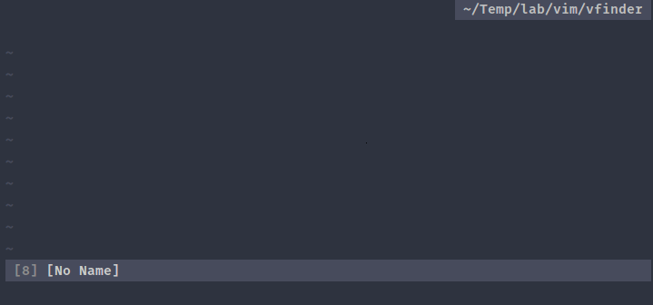

# vFinder [EXPERIMENTAL]


A versatile finder for vim.



**N.B:**

The plugin:
- Is experimental and may change a lot.
- Is not windows compatible yet.
- Is non asynchronous (But may be in the future).
- Projects with <= 20000 files work as expected.
- Use some features from last vim versions so it may not work on old ones.

# Usage

```viml
" Simply execute a default source
call vfinder#i('files')

" Same thing but with fuzzy mode enabled
call vfinder#i('files', {'fuzzy': 1})

" Or use a custom one
call vfinder#i({
        \   'name'      : 'custom',
        \   'to_execute': ['~/.foo', '~/lab/bar'],
        \   'maps'      : {
        \       'i': {'<CR>': {'action': 'cd %s', 'options': {}}},
        \       'n': {'<CR>': {'action': 'cd %s', 'options': {}}}
        \   }
        \ })
```

The candidates are gathered form the key `to_execute` which can be:

- A filename     : `'path/to/foo'`
- A funcref      : `function('s:foo')`
- A list         : `['foo', 'bar']`
- A shell command: `'foo -f --flag2'`

There are no mappings provided for executing sources, please define your owns (See the example of configuration below).

# Global options

| options                         | default value                     | description                                 |
| --------------                  | --------------                    | --------------                              |
| `g:vfinder_verbose`             | `0`                               | Enable/Disable showing useless messages     |
| `g:vfinder_fuzzy`               | `0`                               | Enable/Disable fuzzy matching (May be slow) |
| `g:vfinder_cache_path`          | `$HOME . '/.cache/vfinder'`       | Directory where to store cache files        |
| `g:vfinder_yank_source_enabled` | `1`                               | Enable/Disable yank source which use caching|
| `g:vfinder_mru_source_enabled`  | `1`                               | Enable/Disable mru source which use caching |
| `g:vfinder_maps`                | *See the part about __Mappings__* | Global & per sources actions/mappings       |

# Default sources

The plugin provides the following sources:

- `buffers`
- `colors`
- `command_history`
- `commands`
- `directories`
- `files`<sup>n</sup>
- `marks`
- `mru`<sup>c</sup>
- `oldfiles`
- `outline`<sup>t</sup>
- `registers`
- `spell`
- `tags`<sup>t</sup>
- `yank`<sup>c</sup>

*__<sup>n</sup>__  Need `rg`, `ag`, `git` or `find`.*  
*__<sup>t</sup>__ Need `ctags`.*  
*__<sup>c</sup>__ Use cache files.*

# Mappings

The plugin defines mappings only for the vfinder file type and all of them can be
overwritten with `g:vfinder_maps`.  
The syntax to overwrite a default mapping is the following:

```viml
let g:vfinder_maps = {}
let g:vfinder_maps.scope = {
            \   'i': {
            \       'action1': 'keys',
            \       'action2': 'keys',
            \   },
            \   'n': {
            \       'action' : 'keys',
            \       'action2': 'keys',
            \   }
            \ }

" Note that if you re-source your vimrc often, you should add the following
" function to be sure that your plugin's mappings are up-to-date.
call vfinder#maps#define()
```

Where `i` (insert) and `n` (normal) are the modes where the combination(s) action/keys operates.  
And where `scope` can be:
- `_`: Global mappings that affect all vfinder windows.
- `<source_name>`: Mappings specific to the `<source_name>`.

## Global mappings

| mode | action                 | default value   |
| ---- | ------                 | -----           |
| `i`  | `prompt_backspace`     | `<BS>`          |
| `i`  | `prompt_delete`        | `<Del>`         |
| `i`  | `prompt_delete_line`   | `<C-u>`         |
| `i`  | `prompt_delete_word`   | `<C-w>`         |
| `i`  | `prompt_move_down`     | `<C-n>`         |
| `i`  | `prompt_move_left`     | `<C-h>`         |
| `i`  | `prompt_move_right`    | `<C-l>`         |
| `i`  | `prompt_move_to_end`   | `<C-e>`         |
| `i`  | `prompt_move_to_start` | `<C-a>`         |
| `i`  | `prompt_move_up`       | `<C-p>`         |
| `i`  | `fuzzy_toggle`         | `<C-f>`         |
| `n`  | `fuzzy_toggle`         | `F`             |
| `n`  | `start_insert_mode_a`  | `a`             |
| `n`  | `start_insert_mode_A`  | `A`             |
| `n`  | `start_insert_mode_i`  | `i`             |
| `n`  | `start_insert_mode_I`  | `I`             |
| `i`  | `window_quit`          | `<Esc>`         |
| `n`  | `window_quit`          | `<Esc>`         |
| `i`  | `candidates_update`    | `<C-r>`         |
| `n`  | `candidates_update`    | `R`             |
| `i`  | `cache_clean`          | `<F5>`          |
| `n`  | `cache_clean`          | `<F5>`          |

e.g.

```viml
let g:vfinder_maps = {}
let g:vfinder_maps._ = {
            \   'i': {'candidates_update': '<C-f>'},
            \   'n': {'window_quit'      : 'q'}
            \ }
```

## Per source mappings

### Buffers

| mode | action   | default value |
| ---- | ------   | -----         |
| `i`  | `edit`   | `<CR>`        |
| `n`  | `edit`   | `<CR>`        |
| `i`  | `split`  | `<C-s>`       |
| `n`  | `split`  | `s`           |
| `i`  | `vsplit` | `<C-v>`       |
| `n`  | `vsplit` | `v`           |
| `i`  | `tab`    | `<C-t>`       |
| `n`  | `tab`    | `t`           |
| `i`  | `wipe`   | `<C-d>`       |
| `n`  | `wipe`   | `dd`          |

### Colors

| mode | action    | default value |
| ---- | ------    | -----         |
| `i`  | `apply`   | `<CR>`        |
| `n`  | `apply`   | `<CR>`        |
| `i`  | `preview` | `<C-o>`       |
| `n`  | `preview` | `o`           |

### Commands

| mode | action  | default value |
| ---- | ------  | -----         |
| `i`  | `apply` | `<CR>`        |
| `n`  | `apply` | `<CR>`        |
| `i`  | `echo`  | `<C-o>`       |
| `n`  | `echo`  | `o`           |

### Directories

| mode | action   | default value |
| ---- | ------   | -----         |
| `i`  | `goto`   | `<CR>`        |
| `n`  | `goto`   | `<CR>`        |
| `i`  | `goback` | `<C-v>`       |
| `n`  | `goback` | `v`           |
| `i`  | `cd`     | `<C-s>`       |
| `n`  | `cd`     | `s`           |

### Files

| mode | action   | default value |
| ---- | ------   | -----         |
| `i`  | `edit`   | `<CR>`        |
| `n`  | `edit`   | `<CR>`        |
| `i`  | `split`  | `<C-s>`       |
| `n`  | `split`  | `s`           |
| `i`  | `vsplit` | `<C-v>`       |
| `n`  | `vsplit` | `v`           |
| `i`  | `tab`    | `<C-t>`       |
| `n`  | `tab`    | `t`           |

### Marks

| mode | action   | default value |
| ---- | ------   | -----         |
| `i`  | `goto`   | `<CR>`        |
| `n`  | `goto`   | `<CR>`        |

### Outline

| mode | action          | default value |
| ---- | ------          | -----         |
| `i`  | `goto`          | `<CR>`        |
| `n`  | `goto`          | `<CR>`        |
| `i`  | `splitandgoto`  | `<C-s>`       |
| `n`  | `splitandgoto`  | `s`           |
| `i`  | `vsplitandgoto` | `<C-v>`       |
| `n`  | `vsplitandgoto` | `v`           |

### Spell

| mode | action | default value |
| ---- | ------ | -----         |
| `i`  | `use`  | `<CR>`        |
| `n`  | `use`  | `<CR>`        |

### Tags

| mode | action          | default value |
| ---- | ------          | -----         |
| `i`  | `goto`          | `<CR>`        |
| `n`  | `goto`          | `<CR>`        |
| `i`  | `splitandgoto`  | `<C-s>`       |
| `n`  | `splitandgoto`  | `s`           |
| `i`  | `vsplitandgoto` | `<C-v>`       |
| `n`  | `vsplitandgoto` | `v`           |
| `i`  | `preview`       | `<C-o>`       |
| `n`  | `preview`       | `o`           |

### Yank

| mode | action  | default value |
| ---- | ------  | -----         |
| `i`  | `paste` | `<CR>`        |
| `n`  | `paste` | `<CR>`        |

Some sources do not have actions, because they inherit actions/mappings from other sources.

- `command_history` inherits from `commands`.
- `mru` & `oldfiles` inherits from `files`.
- `registers` inherits from `yank`.

e.g.

```viml
" Define g:vfinder_maps only if its not already defined.
let g:vfinder_maps = {}

let g:vfinder_maps.buffers = {
            \   'i': {
            \       'split' : '<C-k>',
            \       'vsplit': '<C-z>'
            \   }
            \ }
let g:vfinder_maps.spell = {
            \   'i': {'use': '<C-z>'}
            \   'n': {'use': 'zz'}
            \ }
```

# Create a source

*(The following will be documented soon)*

## Source options

- name
- is_valid
- to_execute
- format_fun
- candidate_fun
- syntax_fun
- filter_name
- maps

## Actions

```viml
{
  i:{'action_name': {'action': '%s', 'options': {<see below>}}},
  n:{'action_name': {'action': '%s', 'options': {<see below>}}},
}
```

## Map options

- clear_prompt: `0`
- echo        : `0`
- execute_in_place  : `1`
- function    : `0`
- goto_prompt : `0`
- quit        : `1`
- silent      : `1`
- update      : `0`

# Example of configuration

```viml
let g:vfinder_fuzzy = 0
let g:vfinder_maps = {}
let g:vfinder_maps._ = {'n': {'window_quit': 'q'}}
call vfinder#maps#define()
nnoremap <silent> ,f :call vfinder#i('files')<CR>
nnoremap <silent> ,b :call vfinder#i('buffers')<CR>
nnoremap <silent> ,d :call vfinder#i('directories')<CR>
nnoremap <silent> ,r :call vfinder#i('mru')<CR>
nnoremap <silent> ,c :call vfinder#i('commands')<CR>
nnoremap <silent> ,,c :call vfinder#i('command_history')<CR>
nnoremap <silent> ,t :call vfinder#i('tags')<CR>
nnoremap <silent> ,,f :call vfinder#i('outline')<CR>
nnoremap <silent> z= :call vfinder#i('spell')<CR>
inoremap <silent> <A-z> <Esc>:call vfinder#i('spell')<CR>
nnoremap <silent> ,y :call vfinder#i('yank')<CR>
inoremap <silent> <A-y> <Esc>:call vfinder#i('yank')<CR>
" nnoremap <silent> ,C :call vfinder#i('colors')<CR>
" nnoremap <silent> ,,r :call vfinder#i('oldfiles')<CR>
" nnoremap <silent> ,Y :call vfinder#i('registers')<CR>

nnoremap <silent> ,B :call vfinder#i(<SID>BookmarksSource())<CR>
fun! s:BookmarksSource() abort
    return {
            \   'name'      : 'bookmarks',
            \   'to_execute': ['~/.vim', '~/Temp/lab'],
            \   'maps'      : {
            \       'i': {'<CR>': {'action': 'cd %s', 'options': {'silent': 1}}},
            \       'n': {'<CR>': {'action': 'cd %s', 'options': {'silent': 1}}}
            \   }
            \ }
endfun
```

# Note

There are a lot of things planned for the plugin, but as a side project, I implement what I need when I have time.

# License

MIT
